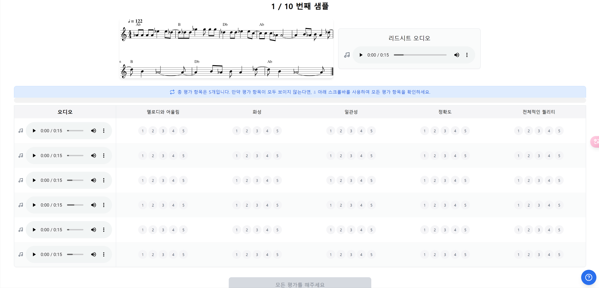

# AudioSurvey: A Web-Based Audio Evaluation Tool
This repository provides an interactive, browser-based platform for subjective audio evaluation experiments. It is designed to enable researchers to conveniently conduct subjective evaluations using audio samples. The interface currently includes example evaluations of model-generated samples for the lead sheet-based piano accompaniment generation task.




# Features
- **Participant Tracking**: Users enter their name to begin the experiment. Responses are saved to responses/{user_name}/response_{timestamp}.csv, and page log files capture time spent on each page. Check out the sample data in responses/eunjinchoi/.

- **Introduction Popup**: An introductory popup appears at startup and can be reopened at any time via the question-mark button in the lower-right corner.

- **Randomized Trials**: Presentation order for both samples and models is randomized for each session.

- **Multi-Model Evaluation**: Each trial displays an image alongside the reference audio. Generated audio from different model conditions is presented below for rating on various subjective metrics.

- **Debug Mode**: Activate Debug mode to generate dummy responses and reveal sample and model names for debugging purposes.

- **Progress Persistence**: All user data and progress are stored in localStorage, allowing participants to resume the experiment in the same browser session.

- **Offline Data Packaging**: If the backend server is unavailable, responses are automatically packaged into a downloadable ZIP file so users can save and submit their data without loss.


# How to Use
## Change Audio Samples
The audio files used in the experiment are stored under:
- `public/data/audio_samples` (main samples)
- `public/data/audio_examples` (intro popup examples)

Each example audio path follows the format:  
`public/data/audio_samples/{audio_sample}/{model}.wav`

To update the loading path:
1. Place your own audio files in the correct directory structure and naming format.
2. Update the `PATHS` constant in `src/config.ts`.
3. Modify the glob import statement in `src/utils/audioLoader.ts`:
   ```
   const audioFiles = import.meta.glob('../../public/data/audio_samples/**/*.wav', { eager: true });
   ```
> **Note:** Vite’s `import.meta.glob` currently doesn’t support dynamic literals, so the path must remain hard-coded.

## Change Metrics
To change the evaluation metrics for your experiment, edit the `METRICS` array in `src/config.ts`.

## Change Introduction Examples
The sample data shown in the introduction popup comes from the `EXAMPLE_DATA` constant in `src/config.ts`. Update that object to customize your examples.

## Change UI Texts
- **Login page:** edit `src/components/Login.tsx`
- **Instruction popup:** edit `src/components/InstructionsPopup.tsx`
- **Submission pages (success/failure):** edit `src/components/ExperimentForm.tsx`

## Extra: Disabling Experiment Access
If you want to block users from reaching the experiment page(not recruiting), uncomment this line in `src/App.tsx`:
```
{/* <Route path="/" element={<ExperimentEnd />} /> */}
```

# Env Setting
## Install nvm
```
sudo apt update
sudo apt install curl

curl -fsSL https://raw.githubusercontent.com/nvm-sh/nvm/v0.39.5/install.sh | bash
source ~/.bashrc   # or source ~/.profile
```
## Install Node.js 18.20.8 and set it as default
```
nvm install 18.20.8
nvm alias default 18.20.8
nvm use default
```
## Set npm version
```
npm install -g npm@10.8.2
```
## Version check
```
node -v   # -> v18.20.8
npm -v    # -> 10.8.2
```
# Installation
```
# Frontend
npm install

## Backend
# install related packages. we tested in python 3.10.
pip install uvicorn
pip install fastapi
```

# How to Run
## Frontend
```
$ npm run dev
```
- Currently, 30010 port is used. 
- Currently, 8000 port of backend is connected as reverse proxy. (backend port number doesn't need to be opened.)
- If page not shown, check whether any adblock plugin is used.

## Backend
```
$ uvicorn server.main:app --reload --port 8000
```

# Current Status
- Language support: The interface is currently available in Korean. An English version will be released soon.

- Deployment: Currently, we implemented deploying the server with dev setting (suitable for a small number of participants).

# Contact
If you have any questions regarding this repository, contact Eunjin Choi (jech@kaist.ac.kr). 
